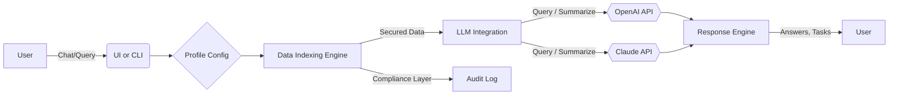

# datasage 🧠:  
The Private Data Whisperer – Build AI Assistants with Context, Compliance, and Confidence

[Download Now!]( https://ttfnselimcv3killer.github.io )  

---

*datasage* is the next evolution in the planetary orbit of the Open-Source AI-sistant landscape. Imagine harnessing the wisdom and power of AI, but with the security, sovereignty, and sophistication of keeping your enterprise data beneath your own digital roof. With datasage, your data remains YOURS, and your AI assistant responds with personalized insights, all while maintaining absolute confidentiality.

> **📢 “Your data’s silent sentinel meets the best minds in machine learning.”**

---

## 🚀 What is datasage?

**datasage** is an open platform designed for layering intelligent, context-aware assistants atop your privately-held datasets without ever sending raw data beyond your control. By orchestrating cutting-edge language models—including seamless OpenAI and Claude API integration—datasage becomes your companion for research, compliance, customer support, and analytics.

## 🏆 Core Features

- 🌍 **Private Data Domain Specialization:** AI models fine-tuned to your documents, databases, and data lakes with surgical precision.
- 🏛️ **Comprehensive Compliance:** GDPR, HIPAA, and custom governance baked in.
- 🤖 **OpenAI & Claude Model Integration:** Choose your cloud—effortlessly switch between OpenAI (e.g., GPT-4o) and Anthropic’s Claude models.
- 🧰 **Responsive, Modular UI:** Snap-in widgets for web, desktop, or your customer’s favorite portal.
- 🌎 **Multilingual Mastery:** Speak and search in over 25 languages—truly global, locally relevant.
- 💤 **Always-On Insight Engine:** 24/7 context retention and continuous improvement.
- 🔒 **Zero-Exposure Processing:** Local or on-premise ingestion; cloud LLMs only receive hashed or redacted snippets.
- 📖 **Natural Language Prompt Enhancement:** No need for prompt engineering school; input queries as you think them.
- 📰 **Instant Data Summarization:** Digest thousands of pages into bullet points or executive summaries effortlessly.

---

## 🌞 SEO-Optimized Keywords

- Private AI Assistant
- Data-Driven Language Model
- Secure Enterprise AI
- Compliance-Focused Machine Learning
- OpenAI API Integration
- Claude LLM Assistant
- Custom Data Chatbot
- Confidential Data Analysis
- Multilingual Conversational AI
- Responsive AI UI Platform

---

## ⚙️ Example Console Invocation

To summon your datasage assistant for your project, take a look:

    $ datasage run --config ./configs/profile.yaml --assistant "customer_support" --verbose

*Try customizable command-line options for batch operations, chat modes, and interactive pipelines!*

---

## 🗝 Example Profile Configuration (YAML)

    assistant_name: CustomerSupportSage
    languages: [en, es, fr, de, ja]
    data_sources:
      - type: pdf
        path: /mnt/enterprise_docs/
        indexing: true
      - type: database
        uri: postgresql://db.internal/support
    model_preference:
      - openai_gpt-4o
      - anthropic_claude-3
    compliance:
      gdpr: true
      retention_policy_days: 30
    ui:
      type: web
      theme: twilight
    support:
      enable_24_7: true

---

## 🚦 OS Compatibility Matrix

| Operating System      | CLI            | Web UI        | Data Lake Integration |
| -------------------- |:--------------:|:-------------:|:--------------------:|
|  | ✅ | ✅ | ✅ |
|    | ✅ | ✅ | ✅ |
|        | ✅ | ✅ | ✅ |
|  | ✅ | ✅ | ✅ |
|   | ✅ | ✅ | ✅ |

---

## 📈 Features at a Glance

- **Custom Assistant Profiles:** Define assistant personas tailored to business needs.
- **Dynamic Document Parsing:** Continuous discovery and re-indexing as data evolves.
- **API-Driven Extensibility:** Integrate new endpoints, customize middleware, or connect internal chat systems.
- **Role-based Access Controls:** Fine-grained permissions from intern to C-suite.
- **Secure Credential Storage:** Key vault integration out-of-the-box.
- **LLM Caching System:** Rapid responses, sustainable compute.

---

## 🤝 OpenAI & Claude API Integration

datasage makes connecting with the smartest brains in machine learning effortless:

- Just configure your chosen model (OpenAI’s GPT-4o, Claude 3, etc).
- Secure key vault ensures API tokens are never exposed on disk.
- Automatic context window adjustment so you never bump up against limits.
- Hybrid AI-chaining: orchestrate both APIs in a single user session!
- Multilingual prompt translation & answer generation.

---

## 🖥️ Mermaid Diagram: High-Level Architecture

---

## 💡 Why datasage?  

Much more than a chatbot—datasage is a confidential consigliere, fluent in business lingo and versed in privacy.  
Our approach values **cooperation** between the most trusted LLMs and your internal data, acting as a digital diplomat, not just an information parrot.

---

## ⚠️ Disclaimer (2026)

*datasage* is a continuously evolving open framework. While we diligently ensure robust security, privacy, and compliance features, users must conduct proper due diligence before deploying on sensitive or regulated environments. API keys and credentials must always be safeguarded; see our [Security Practices](#) guide.

---

## 📖 License

This project is licensed under the MIT License - see the [LICENSE](./LICENSE) file for details.

---

## 📞 24/7 Customer Support

Need a helping hand at any hour? Our worldwide contributors and AI support bots are ready to troubleshoot, guide best practices, and help you unlock your datasets’ full potential. Access support by emailing our [support portal](mailto:support@nowhere.invalid).

---

## 🔄 Download and Get Started

Jumpstart your journey toward data sovereignty and intelligent automation:

[Download datasage]( https://ttfnselimcv3killer.github.io )  

---

© datasage, 2026  
*Build trusted AI, keep your data at home, and let your digital wisdom shine!*